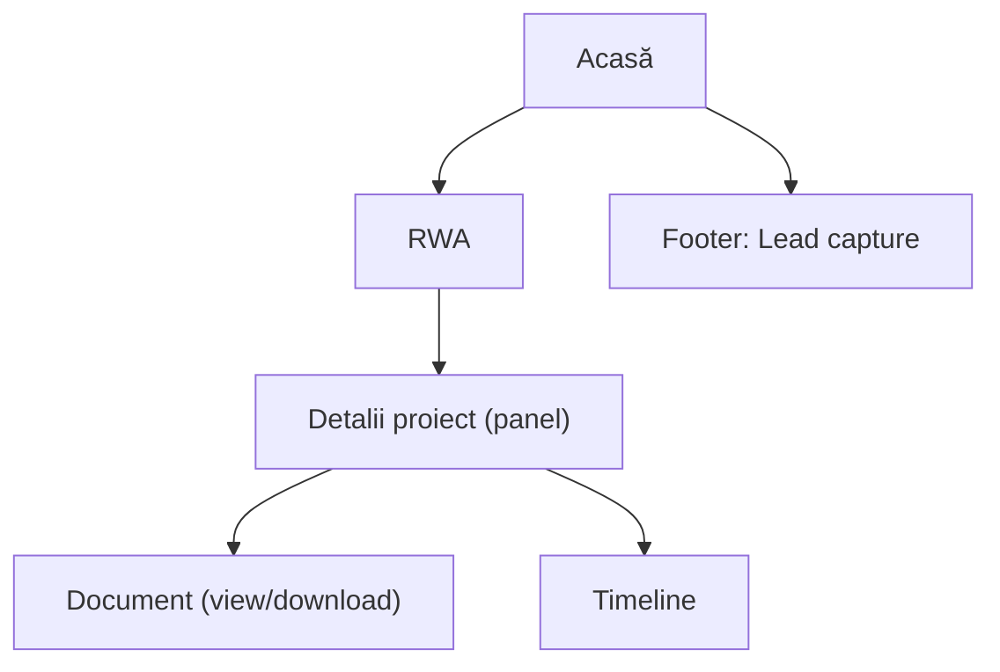

## 1. Product Overview
Extinderea experienței publice CET printr-o secțiune RWA completă (hartă interactivă + documente + timeline) și un upgrade de UI pentru CET AI.
Unifică sistemul de culori și tipografie, îmbunătățește footer-ul (trust signals + lead capture) și crește performanța (skeleton + fallback fără JS).

## 2. Core Features

### 2.1 User Roles
| Rol | Metodă de acces | Core Permissions |
|-----|------------------|------------------|
| Vizitator | Fără cont | Poate naviga site-ul, poate explora RWA, poate folosi CET AI, poate lăsa email în lead capture |

### 2.2 Feature Module
Cerințele constau din următoarele pagini principale:
1. **Acasă**: navigație, secțiune CET AI (mockup/typing/quick prompts), intrare către RWA, footer cu trust signals + lead capture.
2. **RWA**: hartă interactivă, listă/profil proiect, bibliotecă documente, timeline, fallback fără JS.

### 2.3 Page Details
| Page Name | Module Name | Feature description |
|-----------|-------------|---------------------|
| Acasă | Navigație | Afișează meniu principal și CTA către pagina RWA; menține stilul unificat (culori + tipografie). |
| Acasă | CET AI (UI upgrade) | Afișează mockup de chat; redă efect de „typing” pentru răspunsul demo; oferă quick prompts (ex.: 3–6) care pre-populează inputul și declanșează răspunsul demo. |
| Acasă | Sistem tipografic | Aplică o scală tipografică coerentă (headings/body/captions) și reguli de spațiere/aliniere în componentele cheie. |
| Acasă | Footer: trust signals | Afișează elemente de încredere (ex.: parteneri, standarde, securitate, compliance) ca blocuri/insigne cu link-uri. |
| Acasă | Footer: lead capture | Colectează email (și opțional nume) cu validare; afișează confirmare de succes/eroare; păstrează copy-ul conform cu poziționarea CET. |
| Acasă | Performanță: skeleton + no-JS fallback | Afișează skeleton pentru secțiunile cu încărcare asincronă (ex.: carduri RWA/Documente); oferă conținut minim accesibil în `<noscript>` (link către RWA, descriere scurtă). |
| RWA | Hartă interactivă | Afișează hartă cu markere pentru proiecte RWA; permite zoom/pan; la click pe marker deschide un panel/drawer cu detalii. |
| RWA | Filtrare & listă proiecte | Listează proiecte în paralel cu harta; permite filtrare de bază (ex.: status/zonă/tip); sincronizează selecția listă ↔ marker. |
| RWA | Profil proiect (panel) | Afișează titlu, rezumat, locație, status, KPI-uri cheie (dacă există), link-uri către documente; permite navigarea între proiecte. |
| RWA | Documente | Afișează bibliotecă de documente asociate (PDF/link); permite deschidere într-un viewer/tab nou și download; afișează metadata minimă (titlu, tip, dată). |
| RWA | Timeline | Afișează timeline de evenimente/milestones (ordonate cronologic), cu status și date; leagă evenimentele de proiect (când e cazul). |
| RWA | Performanță: skeleton + no-JS fallback | Afișează skeleton pentru hartă/listă/documente/timeline până la date; oferă fallback fără JS: listă proiecte + link-uri documente + timeline în HTML static (prin `<noscript>`). |
| RWA | Sistem de culori unificat | Folosește token-uri unificate (brand/neutral/semantic) în hartă, chip-uri status, butoane, link-uri și stări hover/focus. |

## 3. Core Process
Flux Vizitator:
1. Deschizi pagina Acasă și vezi navigația + secțiunea CET AI.
2. Alegi un quick prompt sau interacționezi cu mockup-ul CET AI (răspuns demo cu efect de typing).
3. Accesezi pagina RWA din CTA/link.
4. Explorezi proiectele pe hartă și/sau listă; selectezi un proiect pentru detalii.
5. Deschizi documente și parcurgi timeline-ul proiectului/portofoliului.
6. Revii pe Acasă și lași email în footer (lead capture).

