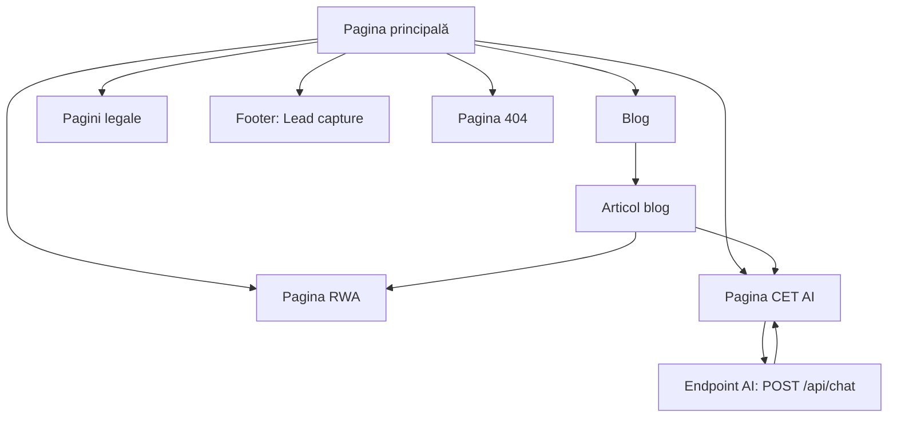

## 1. Product Overview
Îmbunătățiri UI/UX, conținut, SEO și performanță pentru secțiunile publice RWA și CET AI.
Ținta este o experiență coerentă (design system), mai convingătoare (trust + documente), mai interactivă (hartă/timeline/demo) și robustă.

## 2. Core Features

### 2.1 User Roles
Nu este necesară diferențierea pe roluri (conținut public).

### 2.2 Feature Module
Cerințele sunt acoperite de următoarele pagini:
1. **Pagina principală**: hero RWA cu vizual, preview hartă + timeline, teaser CET AI (mockup/quick prompts), entrypoint către RWA și demo, footer cu trust signals + lead capture + switcher limbă (RO/EN).
2. **Pagina RWA**: hartă interactivă (explorare), timeline complet, listă documente (preview/download), media/galerie, fallback fără JS (RO/EN).
3. **Pagina CET AI**: demo live (chat UI complet), explicație scurtă capabilități/limitări, privacy notice, CTA către contact (RO/EN).
4. **Blog**: listă articole + filtrare minimă, pagină articol (slug SEO), navigare între articole, suport RO/EN.
5. **Pagini legale**: Privacy Policy, Terms, Cookies (RO/EN), accesibile din footer.
6. **Pagina 404**: mesaj clar, link-uri utile și căutare/navigare către pagini cheie.

### 2.3 Page Details
| Page Name | Module Name | Feature description |
|-----------|-------------|------------------|
| Global (toate paginile) | Sistem tipografie + spațiere | Definește scale (H1–H6, body, caption), greutăți, line-height și reguli de spacing (multipli de 4px) aplicate consistent în componente. |
| Global (toate paginile) | Sistem culori + stări | Definește paletă (brand/neutral/semantic), stări (hover/focus/disabled), contrast minim și reguli de utilizare pe fundaluri/suprafețe. |
| Global (toate paginile) | Navigație | Afișează header cu link-uri către: Acasă, RWA, CET AI; păstrează starea activă și suportă layout responsive. |
| Global (toate paginile) | SEO de bază | Configurează per pagină: `title`, `meta description`, Open Graph, Twitter Card, canonical; asigură heading hierarchy corect (un singur H1/pagină) și link-uri interne coerente. |
| Global (toate paginile) | SEO i18n (RO/EN) | Expune toggle de limbă; generează `hreflang` (ro-RO, en) + `x-default`; menține mapping între rute (ex. `/rwa` ↔ `/en/rwa`) și canonical per limbă. |
| Global (toate paginile) | Sitemap + robots | Publică `sitemap.xml` (include toate rutele indexabile + variantele RO/EN) și `robots.txt` cu link către sitemap; exclude rute tehnice (`/api/*`). |
| Global (toate paginile) | JSON-LD | Injectează structured data: `Organization` + `WebSite` (global); `BlogPosting` pe pagini de articol; `BreadcrumbList` unde există ierarhie (Blog). |
| Global (toate paginile) | Performanță percepută | Folosește skeleton/placeholder pentru conținut asincron; lazy-load pentru imagini sub fold; code-splitting pe rute. |
| Global (toate paginile) | Footer: trust + lead capture | Afișează trust signals (logo-uri/insigne + link-uri) și formular de email cu validare + stări succes/eroare (lead capture). |
| Pagina principală | Hero RWA (vizual) | Afișează copy scurt + beneficii; vizual (foto) cu parallax subtil (dezactivabil la reduced-motion); CTA către pagina RWA. |
| Pagina principală | Preview RWA (hartă + timeline) | Integrează preview hartă (interacțiuni minime) + timeline scurt (3–5 repere), cu link către explorarea completă pe /rwa. |
| Pagina principală | Teaser CET AI (preview) | Afișează mockup de chat + quick prompts (3–6) care pre-populează inputul; include CTA către /cet-ai pentru demo live. |
| Pagina RWA | Hartă interactivă | Permite zoom/pan, selectare punct/zonă, afișare detalii (tooltip/drawer), filtre minime (ex: status/regiune/tip) și link către documente asociate. |
| Pagina RWA | Timeline complet | Afișează cronologic etape/progrese; suportă expand/collapse, ancore (deep-link) și evidențiere „astăzi”. |
| Pagina RWA | Documente | Listează documente cu categorie + căutare simplă; suportă preview (când e posibil) și download; afișează „last updated”. |
| Pagina RWA | Media/galerie | Afișează imagini relevante cu încărcare performantă și descrieri (alt text). |
| Pagina RWA | Fallback fără JS | În `<noscript>`, afișează listă proiecte + link-uri documente + timeline în HTML static și mesaj „Pentru hartă interactivă, activează JavaScript.” |
| Pagina CET AI | Demo UI (live) | Trimite prompt către endpoint securizat (`POST /api/chat`) și afișează răspunsul în format RAV; include stări: idle/loading/success/error, retry, stop/cancel, reset și exemple predefinite. |
| Pagina CET AI | Explicație, limite și confidențialitate | Clarifică ce face demo-ul și limitele; include mențiune despre context on-chain (DeDust) când e disponibil și privacy notice: nu introduce date personale; conversația nu este salvată server-side. |
| Blog | Listă articole | Listează articole cu: titlu, excerpt, dată, autor (opțional), tag/categorie (opțional), imagine; suportă paginare simplă; link către articol prin slug. |
| Blog | Articol (detalii) | Afișează conținut (Markdown/MDX sau HTML), tabel de conținut (dacă e lung), navigare next/prev; setează meta per articol (title/description/OG) + JSON-LD `BlogPosting`. |
| Pagini legale | Conținut legal (RO/EN) | Afișează Privacy Policy, Terms și Cookies (versiune + „ultima actualizare”); include date de contact; descrie newsletter/lead capture (temei + consimțământ) și cookies (dacă există). |
| Pagina 404 | Not Found | Afișează mesaj clar, CTA către Home/RWA/CET AI/Blog, și păstrează header/footer pentru navigare rapidă. |

## 3. Core Process
Flux vizitator (public):
1. Intri pe Pagina principală, alegi limba (RO/EN) și înțelegi rapid oferta (RWA + CET AI).
2. Navighezi către /rwa pentru explorare (hartă/timeline/documente) sau către /cet-ai pentru demo.
3. Dacă vrei context editorial, mergi în Blog, deschizi un articol și continui către pagini produs (link-uri interne).
4. Dacă ai nevoie de claritate juridică, accesezi paginile legale din footer.
5. Dacă ajungi pe o rută invalidă, Pagina 404 te redirecționează prin link-uri utile.

## 4. Criterii de acceptanță (aliniate TASK 05–10)
### TASK 05 — Sistem vizual unitar (UI)
1. Tipografie și culori sunt definite ca token-uri și folosite consecvent în header, carduri, chips, butoane și link-uri.
2. Stările hover/focus/disabled există pentru controale interactive; focus ring este vizibil (a11y).

### TASK 06 — RWA (hartă + timeline + documente)
3. /rwa permite pan/zoom, selectare marker și afișează detalii într-un panel/drawer fără crash.
4. Timeline-ul suportă expand/collapse și deep-link (ancore) către repere.
5. Documentele se pot preview (când e posibil) și download; fiecare item afișează minim: titlu, tip/categorie, dată/„last updated”.
6. Există fallback fără JS (noscript) cu conținut util (listă proiecte + documente + timeline).

### TASK 07 — CET AI (endpoint securizat + UI demo)
7. UI-ul CET AI folosește exclusiv `POST /api/chat` (fără chei API în frontend).
8. UI are stări: idle/loading/success/error și acțiuni: stop/cancel (abort request), retry, reset; include 3–6 prompturi preset.
9. La lipsa provider-ului AI sau a contextului on-chain, aplicația degradează controlat (mesaj clar, fără crash).

### TASK 08 — Rate limit, robustețe, privacy
10. La `429`, UI afișează mesaj de rate limit + buton „Încearcă din nou” (și opțional countdown).
11. Pe /cet-ai există un privacy notice vizibil: „Nu introduce date personale; conversația nu este salvată server-side.”

### TASK 09 — SEO
12. Fiecare pagină are `title`, `description`, Open Graph și canonical; există un singur H1/pagină.
13. Toate imaginile au `alt` și fallback pentru lipsă asset.

### TASK 10 — Performanță
14. Code-splitting pe rute: librăria de hartă se încarcă doar pe /rwa; componente grele se încarcă lazy.
15. Imagini sub fold sunt lazy-loaded; există placeholder (blur/skeleton/inline SVG) pentru hero/media.
16. Animațiile (parallax/typing) respectă `prefers-reduced-motion`.
