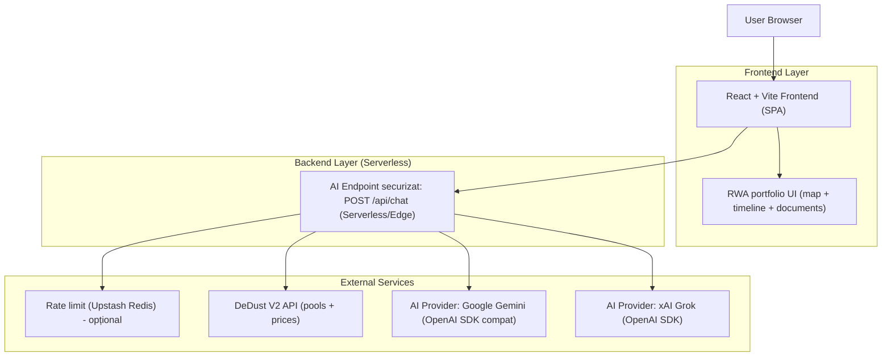
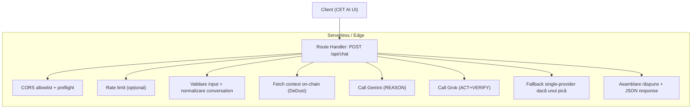
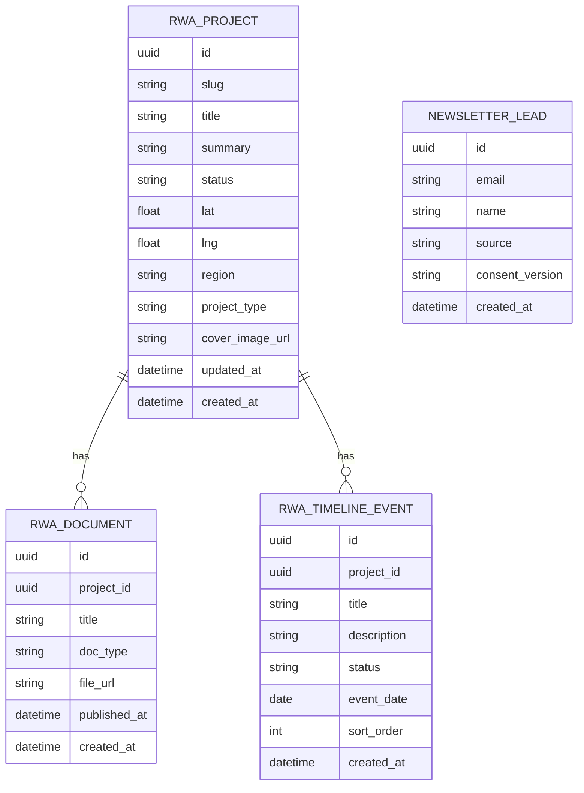

## 1.Architecture design


## 2.Technology Description
- Frontend: React@18+ (sau 19) + TypeScript + vite
- Styling/UI: tailwindcss@3 + Radix UI (Dialog/Popover/Accordion) pentru componente accesibile
- SEO (client-side): `react-helmet-async` (sau echivalent) pentru `title`, `meta description`, canonical, OG/Twitter și `hreflang`; componente JSON-LD (script `application/ld+json`).
- i18n: `i18next` + `react-i18next`, cu RO default și prefix `/en/*` pentru EN; mapping rută-curentă ↔ rută în cealaltă limbă.
- Conținut Blog: fișiere Markdown/MDX cu frontmatter (title, description, slug, date, image, locale, translationKey) + generare rute la build.
- SEO assets: `robots.txt` și `sitemap.xml` generate la build și servite ca fișiere statice (în `public/`).
- RWA: dataset local (static) în `app/src/lib/rwaPortfolio.ts` + componente UI (map/timeline/docs)
- Backend (doar pentru AI): route handler serverless/edge `POST /api/chat` (OpenAI SDK), cu:
  - chei API doar pe server (env), fără expunere în client
  - validare input + normalizare context multi-turn (max 24 mesaje)
  - CORS allowlist + răspuns corect la preflight `OPTIONS`
  - timeout + abort, fallback single-provider dacă unul pică
  - fetch context on-chain (DeDust) cu timeout și degradare graceful
  - rate limit IP-based (ex. 10 req / 10s) dacă este configurat Upstash
- PWA: `vite-plugin-pwa` cu `generateSW`; precache limitat + runtime caching pentru chunks (assets) și endpoint-uri publice

## 3.Route definitions
| Route | Purpose |
|-------|---------|
| / | Pagina principală (RO): hero/preview RWA, teaser CET AI, trust + lead capture + switch limbă |
| /rwa | Pagina RWA (RO): hartă interactivă + timeline + documente + fallback fără JS |
| /cet-ai | Pagina CET AI (RO): demo live + explicații/limitări + privacy notice |
| /blog | Blog (RO): listă articole + paginare |
| /blog/:slug | Articol Blog (RO): conținut + meta + JSON-LD `BlogPosting` |
| /legal/privacy | Privacy Policy (RO) |
| /legal/terms | Terms of Use (RO) |
| /legal/cookies | Cookie Policy (RO) |
| /404 | Pagina 404 (UI) |
| /en/* | Variante EN pentru rutele publice (ex. `/en/rwa`, `/en/blog/:slug`) |
| /api/chat | Endpoint AI securizat (server-side), folosit doar de UI-ul CET AI |
| /robots.txt | Robots directives + link către sitemap |
| /sitemap.xml | Sitemap (include URL-uri RO + EN) |

## 4.API definitions
### 4.1 POST /api/chat
Scop: rulează CET AI (format RAV) folosind Grok × Gemini, cu context on-chain (DeDust) când e disponibil.

Request (JSON)
| Param | Type | Required | Descriere |
|------|------|----------|----------|
| query | string | da | Întrebarea utilizatorului (trim; limită prin config, ex. `CET_AI_MAX_QUERY_CHARS`). |
| conversation | {role:'user'\|'assistant', content:string}[] | nu | Context multi-turn (max 24; fiecare `content` poate fi trunchiat la limită). |

Response (JSON)
| Param | Type | Descriere |
|------|------|----------|
| response | string | Răspunsul modelului (format RAV). |

Erori (JSON)
- `400` `{ "message": "..." }` (validare)
- `429` `{ "error": "Rate limited" }` (când rate limit este activ)
- `500` `{ "message": "..." }` (providers indisponibili / config lipsă)

TypeScript (shared)
```ts
type ChatMessage = { role: 'user' | 'assistant'; content: string };

type ChatRequest = {
  query: string;
  conversation?: ChatMessage[];
};

type ChatResponse = {
  response: string;
};
```

## 5.Server architecture diagram


## 6.Data model(if applicable)
### 6.1 Data model definition
Modelul de mai jos este opțional (pentru când RWA este migrat din dataset local către o bază de date). În implementarea actuală, portofoliul RWA este servit din fișiere TS statice.


### 6.2 Data Definition Language
RWA Projects (rwa_projects)
```sql
CREATE TABLE rwa_projects (
  id UUID PRIMARY KEY DEFAULT gen_random_uuid(),
  slug TEXT UNIQUE NOT NULL,
  title TEXT NOT NULL,
  summary TEXT NOT NULL,
  status TEXT NOT NULL,
  lat DOUBLE PRECISION NOT NULL,
  lng DOUBLE PRECISION NOT NULL,
  region TEXT,
  project_type TEXT,
  cover_image_url TEXT,
  created_at TIMESTAMPTZ NOT NULL DEFAULT NOW(),
  updated_at TIMESTAMPTZ NOT NULL DEFAULT NOW()
);

GRANT SELECT ON rwa_projects TO anon;
GRANT ALL PRIVILEGES ON rwa_projects TO authenticated;
```

RWA Documents (rwa_documents)
```sql
CREATE TABLE rwa_documents (
  id UUID PRIMARY KEY DEFAULT gen_random_uuid(),
  project_id UUID NOT NULL,
  title TEXT NOT NULL,
  doc_type TEXT NOT NULL,
  file_url TEXT NOT NULL,
  published_at TIMESTAMPTZ,
  created_at TIMESTAMPTZ NOT NULL DEFAULT NOW()
);

CREATE INDEX idx_rwa_documents_project_id ON rwa_documents(project_id);

GRANT SELECT ON rwa_documents TO anon;
GRANT ALL PRIVILEGES ON rwa_documents TO authenticated;
```

RWA Timeline Events (rwa_timeline_events)
```sql
CREATE TABLE rwa_timeline_events (
  id UUID PRIMARY KEY DEFAULT gen_random_uuid(),
  project_id UUID NOT NULL,
  title TEXT NOT NULL,
  description TEXT,
  status TEXT NOT NULL,
  event_date DATE NOT NULL,
  sort_order INTEGER NOT NULL DEFAULT 0,
  created_at TIMESTAMPTZ NOT NULL DEFAULT NOW()
);

CREATE INDEX idx_rwa_timeline_events_project_id ON rwa_timeline_events(project_id);
CREATE INDEX idx_rwa_timeline_events_event_date ON rwa_timeline_events(event_date);

GRANT SELECT ON rwa_timeline_events TO anon;
GRANT ALL PRIVILEGES ON rwa_timeline_events TO authenticated;
```

Newsletter Leads (newsletter_leads)
```sql
CREATE TABLE newsletter_leads (
  id UUID PRIMARY KEY DEFAULT gen_random_uuid(),
  email TEXT NOT NULL,
  name TEXT,
  source TEXT NOT NULL DEFAULT 'footer',
  consent_version TEXT,
  created_at TIMESTAMPTZ NOT NULL DEFAULT NOW()
);

CREATE UNIQUE INDEX idx_newsletter_leads_email ON newsletter_leads(lower(email));

GRANT INSERT ON newsletter_leads TO anon;
GRANT ALL PRIVILEGES ON newsletter_leads TO authenticated;
```

Storage (recomandare)
- Bucket: `rwa-documents` (public read) pentru PDF-uri/fișiere; `file_url` poate fi URL public sau path către fișier în bucket.
