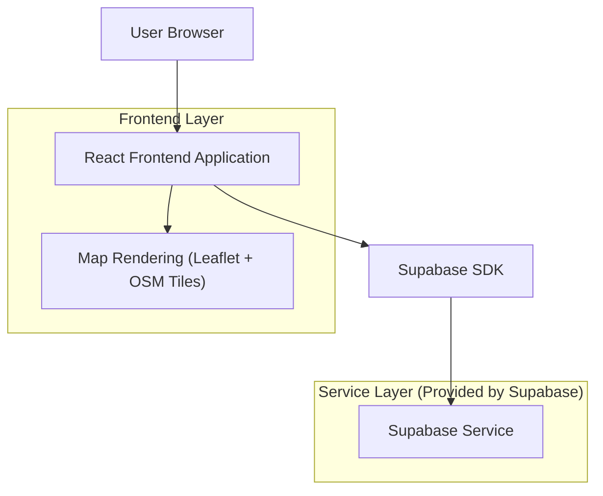
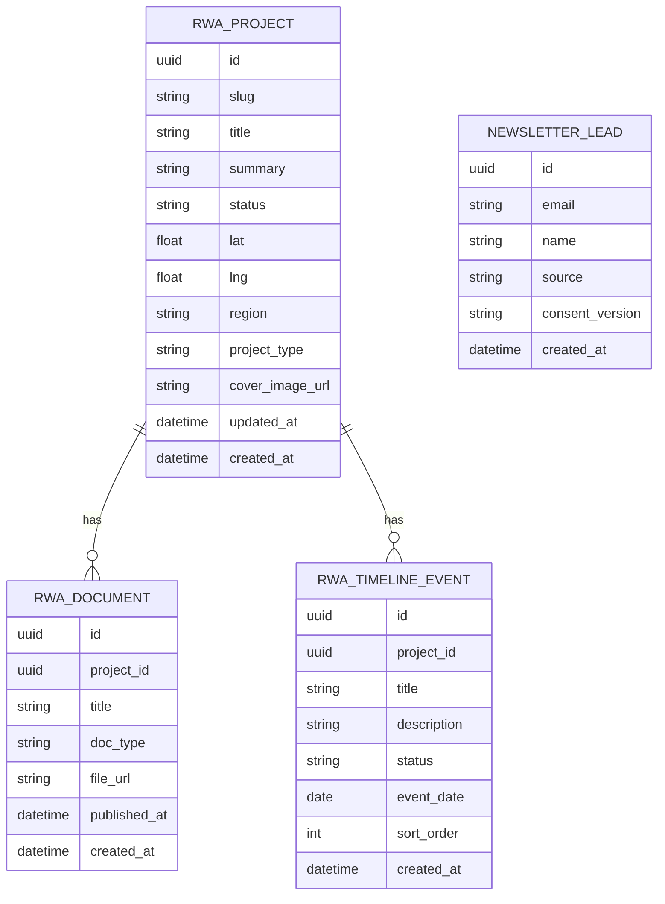

## 1.Architecture design


## 2.Technology Description
- Frontend: React@18 + TypeScript + vite
- Styling/UI: tailwindcss@3 (design tokens pentru culori + tipografie) 
- Map: leaflet (OpenStreetMap tiles) 
- Backend: Supabase (PostgreSQL + Storage) pentru: catalog proiecte RWA, documente, timeline, lead capture

## 3.Route definitions
| Route | Purpose |
|-------|---------|
| / | Acasă: CET AI UI (mockup/typing/quick prompts), entry către RWA, footer trust signals + lead capture |
| /rwa | RWA: hartă interactivă + listă proiecte + documente + timeline + fallback fără JS |

## 6.Data model(if applicable)

### 6.1 Data model definition


### 6.2 Data Definition Language
RWA Projects (rwa_projects)
```sql
-- create table
CREATE TABLE rwa_projects (
  id UUID PRIMARY KEY DEFAULT gen_random_uuid(),
  slug TEXT UNIQUE NOT NULL,
  title TEXT NOT NULL,
  summary TEXT NOT NULL,
  status TEXT NOT NULL,
  lat DOUBLE PRECISION NOT NULL,
  lng DOUBLE PRECISION NOT NULL,
  region TEXT,
  project_type TEXT,
  cover_image_url TEXT,
  created_at TIMESTAMPTZ NOT NULL DEFAULT NOW(),
  updated_at TIMESTAMPTZ NOT NULL DEFAULT NOW()
);

-- permissions (no physical FKs; public read)
GRANT SELECT ON rwa_projects TO anon;
GRANT ALL PRIVILEGES ON rwa_projects TO authenticated;
```

RWA Documents (rwa_documents)
```sql
CREATE TABLE rwa_documents (
  id UUID PRIMARY KEY DEFAULT gen_random_uuid(),
  project_id UUID NOT NULL,
  title TEXT NOT NULL,
  doc_type TEXT NOT NULL,
  file_url TEXT NOT NULL,
  published_at TIMESTAMPTZ,
  created_at TIMESTAMPTZ NOT NULL DEFAULT NOW()
);

CREATE INDEX idx_rwa_documents_project_id ON rwa_documents(project_id);

GRANT SELECT ON rwa_documents TO anon;
GRANT ALL PRIVILEGES ON rwa_documents TO authenticated;
```

RWA Timeline Events (rwa_timeline_events)
```sql
CREATE TABLE rwa_timeline_events (
  id UUID PRIMARY KEY DEFAULT gen_random_uuid(),
  project_id UUID NOT NULL,
  title TEXT NOT NULL,
  description TEXT,
  status TEXT NOT NULL,
  event_date DATE NOT NULL,
  sort_order INTEGER NOT NULL DEFAULT 0,
  created_at TIMESTAMPTZ NOT NULL DEFAULT NOW()
);

CREATE INDEX idx_rwa_timeline_events_project_id ON rwa_timeline_events(project_id);
CREATE INDEX idx_rwa_timeline_events_event_date ON rwa_timeline_events(event_date);

GRANT SELECT ON rwa_timeline_events TO anon;
GRANT ALL PRIVILEGES ON rwa_timeline_events TO authenticated;
```

Newsletter Leads (newsletter_leads)
```sql
CREATE TABLE newsletter_leads (
  id UUID PRIMARY KEY DEFAULT gen_random_uuid(),
  email TEXT NOT NULL,
  name TEXT,
  source TEXT NOT NULL DEFAULT 'footer',
  consent_version TEXT,
  created_at TIMESTAMPTZ NOT NULL DEFAULT NOW()
);

CREATE UNIQUE INDEX idx_newsletter_leads_email ON newsletter_leads(lower(email));

-- allow public inserts for lead capture; keep read restricted
GRANT INSERT ON newsletter_leads TO anon;
GRANT ALL PRIVILEGES ON newsletter_leads TO authenticated;
```

Storage (recomandare)
- Bucket: `rwa-documents` (public read) pentru PDF-uri/fișiere.
- `file_url` poate fi URL public sau path semnat (dacă ulterior vrei