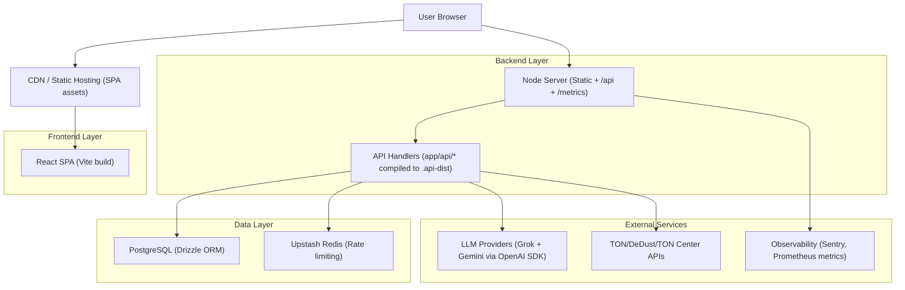

## 1.Architecture design



## 2.Technology Description

- Frontend: React@19 + Vite@8 + TypeScript@5.8 + TailwindCSS@4 + Radix UI + GSAP + three.js/@react-three
- Backend: Node.js@22 (server HTTP custom pentru static + routing API) + handlers tip Fetch (Request/Response)
- Database: PostgreSQL + drizzle-orm + drizzle-kit (migrations)
- Rate limiting: Upstash Redis (REST)
- Observability: Sentry Node + endpoint Prometheus `/metrics` (server) + probe extern periodic (GitHub Actions)
- Testing: Vitest (unit) + Playwright (E2E)

## 3.Route definitions

| Route | Purpose |
|-------|---------|
| / | Landing page (secțiuni scroll + navigație ancore) |
| /rwa | Pagina RWA (conținut dedicat) |
| /cet-ai | Pagina CET AI (widget + explicații) |
| /demo | Demo page (experiență/experimentare) |
| /mining | Deep-link către secțiunea mining din Home |

## 4.API definitions

### 4.1 Core API

Health & status
```
GET /api/health
GET /api/status
GET /api/metrics
GET /metrics
```

CET AI chat
```
POST /api/chat
```

Request (body JSON):
| Param Name | Param Type | isRequired | Description |
|-----------|------------|------------|-------------|
| query | string | true | Întrebarea utilizatorului (maxim conform limitelor din aplicație) |
| conversation | { role: 'user' \| 'assistant'; content: string }[] | false | Context conversație (max. 24 mesaje) |

Response (body JSON, succes):
| Param Name | Param Type | Description |
|-----------|------------|-------------|
| message | string | Răspunsul CET AI |

Response (body JSON, eroare):
| Param Name | Param Type | Description |
|-----------|------------|-------------|
| error | string | Eroare generică (ex: method not allowed) |
| message | string | Mesaj eroare (validare, lipsă chei, etc.) |

### 4.2 Shared TypeScript types (frontend/backend)

```ts
export type ApiError = { error?: string; message?: string };

export type HealthResponse = {
  status: 'ok';
  checks: {
    db: 'configured' | 'missing';
    ai: 'configured' | 'missing';
    ton: 'configured' | 'missing';
    rateLimit: 'configured' | 'missing';
    jwt: 'configured' | 'missing';
  };
  build: { gitSha: string | null; node: string | null };
  time: string;
};

export type ChatRequest = {
  query: string;
  conversation?: { role: 'user' | 'assistant'; content: string }[];
};

export type ChatResponse = { message: string };
```

## 6.Data model(if applicable)

### 6.1 Data model definition

- users: utilizator identificat prin wallet (wallet_address), points, referral_code
- sessions: sesiuni de autentificare/JWT tracking (expires_at, revoked_at, metadata)
- mining_sessions: sesiuni de mining (start_time, last_check, is_running, mined_amount)
- transactions: tranzacții (type BUY/SELL/MINE, amount, status, tx_hash)
- audit_logs: jurnal audit (action, details, wallet_address)

### 6.2 Data Definition Language

Notă: schema este gestionată prin Drizzle; DDL-ul exact este generat/gestionat de `dr