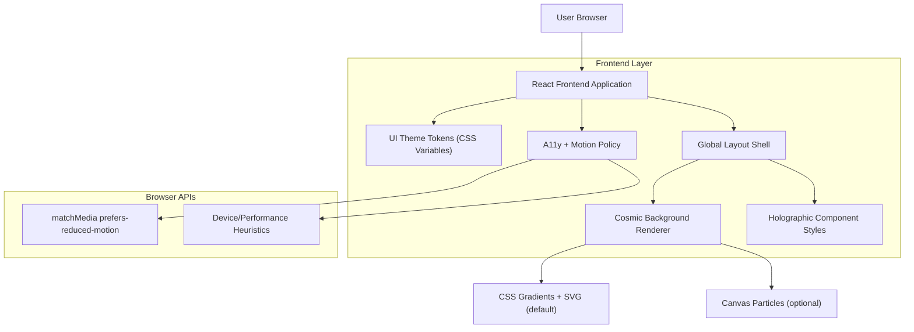

## 1.Architecture design

## 2.Technology Description
- Frontend: React@18 + vite
- Styling: tailwindcss@3 (sau CSS Modules) + CSS Variables pentru tokens (culori/spacing/radius/elevations)
- Animation: CSS transitions/animations (minim), fără librării grele; Canvas doar opțional și dezactivabil
- Backend: None

## 3.Route definitions
| Route | Purpose |
|-------|---------|
| / | Home (hero + secțiuni principale) |
| /pagina/:slug | Pagină de conținut (template generic) |
| /formular | Pagină de formular (template) pentru verificarea stărilor UI (inputs, erori, focus) |

## 6.Data model(if applicable)
Nu este necesar (schimbare exclusiv UI).

### Note de implementare (constrângeri cheie)
- Politică motion: dacă `prefers-reduced-motion: reduce`, atunci dezactivezi: particule, parallax, shimmer continuu; păstrezi doar tranziții scurte (ex: 120–180ms) pentru feedback.
- Performanță mobile: profil „lite” implicit pe ecrane mici; efecte costisitoare (blur mare, multe straturi, animații infinite) sunt înlocuite cu fundal static (gradient/AVIF/WebP) + noise discret.
- A11y: focus ring vizibil, fără „outline: none”; verificare contrast pentru text și stări (hover/focus/disabled); evită mișcări mari/flash; păstrează hit-area minimă pentru butoane.
