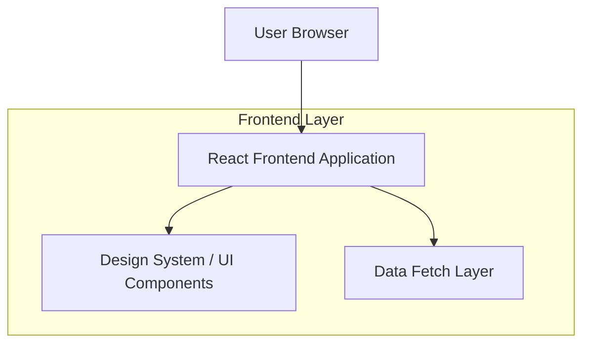

## 1.Architecture design

## 2.Technology Description
- Frontend: React@18 (SPA) + TypeScript
- Styling: CSS variables pentru theming + (opțional) utilitare Tailwind sau CSS Modules (în funcție de codebase)
- UI/UX: IntersectionObserver (scroll reveal), native focus management, aria-live pentru stări
- Backend: None (nu este necesar pentru cerințele de optimizare UI)

## 3.Route definitions
| Route | Purpose |
|-------|---------|
| / | Pagina de Căutare & Rezultate (căutare, listare, filtrare, stări de încărcare) |
| /result/:id | Pagina Detalii Rezultat |

## 4.Implementation notes (UI Optimization)
### 4.1 Responsive (desktop-first)
- Definește breakpoint-uri consistente (ex. 360/480/768/1024/1280/1536) și un layout fluid (Grid pentru zonele mari, Flex pentru componente).
- Evită dimensiuni fixe; folosește `clamp()` pentru tipografie/spațiere.
- Testează overflow, zoom 200% și reflow (criterii WCAG).

### 4.2 Skeleton loaders
- Creează componente Skeleton dedicate: `ResultCardSkeleton`, `SidebarSkeleton`, `DetailSkeleton`.
- Menține aceeași amprentă de layout ca varianta finală (reduce CLS).
- Controlează stările: `idle/loading/success/error` și afișează placeholder în `loading`.

### 4.3 Lazy loading componente non-critice
- Folosește `React.lazy()` + `Suspense` pentru: filtre avansate, secțiuni informative, panouri secundare.
- Păstrează conținutul critic (header, input căutare, container rezultate, first-page results) în bundle-ul inițial.
- Preload condiționat: la `hover`/`focus` pe trigger sau după primul paint.

### 4.4 Dark mode persistent
- Implementare recomandată: CSS variables pe `:root` + atribut `data-theme="dark|light"`.
- Persistență: `localStorage` (cheie ex. `aio-theme`), cu fallback la `prefers-color-scheme` la prima vizită.
- Evită „flash” de temă: aplică tema cât mai devreme (inline script minimal sau hydration-safe).

### 4.5 Back to Top accesibil
- Buton vizibil după prag de scroll (ex. 400–600px) și ascuns altfel.
- Accesibilitate: `button` semantic, `aria-label="Înapoi sus"`, focus ring clar, suport Enter/Space.
- Scroll: `window.scrollTo({ top: 0, behavior: 'smooth' })` cu fallback la instant când `prefers-reduced-motion`.

### 4.6 Animații subtile la scroll
- Declanșare cu IntersectionObserver; animații scurte (150–250ms), `opacity + transform`.
- Respectă `prefers-reduced-motion: reduce` (dezactivează transform/transition).
- Nu anima proprietăți costisitoare (evită layout thrash).

### 4.7 WCAG 2.x AA (checklist practic)
- Contrast AA pentru text/icoane; focus vizibil (nu elimina outline fără alternativă).
- Navigare din tastatură: ordine logică, skip link spre conținut, capcane de focus evitate.
- Semnatică: headings ierarhice, label pentru input (nu doar placeholder), `aria-live` pentru stări/erori.
- Form errors: mesaje clare, asociate cu câmpul (ex. `aria-describedby`).

### 4.8 Cross-browser
- Target: Chrome/Edge/Firefox/Safari (ultimele 2 versiuni majore), plus Safari iOS.
- Evită API-uri fără fallback; verifică suport pentru `scroll-behavior`, `position: sticky`, `:focus-visible` (cu fallback la `:focus`).
- QA: test matrice pe browsere +