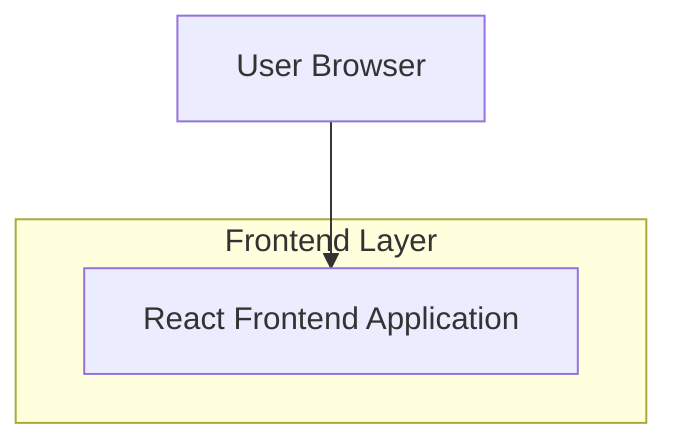

## 1.Architecture design

## 2.Technology Description
- Frontend: React@18 + TypeScript + vite
- Styling: tailwindcss@3 (sau CSS Modules)
- Backend: None

## 3.Route definitions
| Route | Purpose |
|-------|---------|
| / | Landing page cu hero (video/animat), 2 CTA-uri, stats animate, layout mobil simplificat |

## 6.Data model(if applicable)
Nu este necesar (pagină statică / fără persistare).

### Note tehnice cheie (implementare)
- Fundal video:
  - Element `<video>` cu `muted`, `playsInline`, `loop`, `autoPlay` (cu fallback la poster). 
  - Pe mobil / conexiuni lente: folosește poster static și evită autoplay; condiționează prin breakpoint și/sau `prefers-reduced-motion`.
- Overlay întunecat:
  - Layer absolut peste media (ex: gradient negru cu opacitate 50–70%) pentru contrast constant.
- CTA glow auriu:
  - Stiluri pentru normal/hover/focus; folosește `box-shadow` + `outline` pentru focus; evită glow agresiv pe mobil.
- Stats counters:
  - Declanșare cu `IntersectionObserver` (start la intrarea în viewport).
  - Animație cu `requestAnimationFrame` (easing) sau interval; respectă `prefers-reduced-motion` (afișează direct valoarea finală).
- Performanță:
  - Lazy-load pentru video (preload controlat), compresie, dimensiuni adaptive; minimizare reflow.
- Accesibilitate:
  - Contrast text peste overlay; butoane cu focus clar; aria-label pentru CTA dacă text